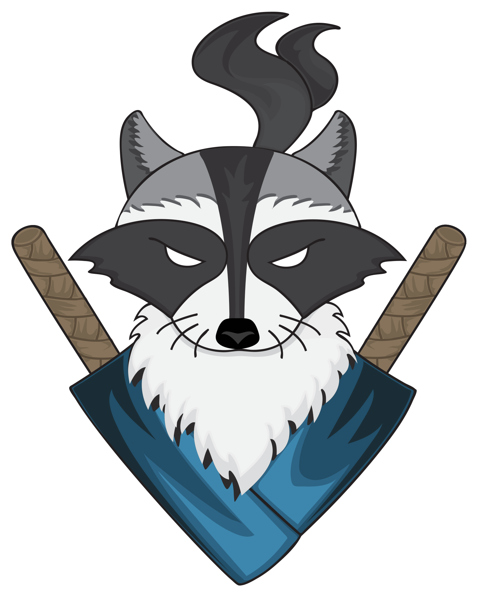

<p align="center">
  
</p>

## About

Tradeup Ninja is a website designed to assist in searching for profitable trade ups in CS:GO. Store that information securely
    in the browser for future use, and feature to save trade ups you have already done to help keep track of your profits!

Initially this project was made to help me not only to work with trade ups but also to express myself as a
    developer. Tradeup Ninja is a hobby project that I love developing aside from my full-time job. I already started working on 2nd version
    with redesign and some re-work but I don't know when or if it will get released.

#### This project is Production ready Angular application with SSR and Backend by NestJS. Feel free to investigate it and if you have any questions open an Issue or contact me via [our Discord](https://discord.gg/wAXJBpu)

## Key project features
- Search for trade ups using custom parameters such as profit, success odds, expected value (EV), and many others
- Trade up results page with different stats and overviews
- Trade up saving for future completion (Saves as uncompleted trade up in results page)
- Trade up simulation. You can simulate found trade ups so you can overview different scenarios how each particular
      trade up will result and gain some statistical information
- Trade up calculator. This feature also has a handy duplicator for filler skins so you do not have to search for the same skins multiple times
- Ability to set custom prices for skins within calculator
- Trade up input item overview page that is sorted by lowest **min float cap**. There is an option to review skins by rarity or collection
- Daily price sync with CsgoTraderAPP and caching
- Sticker price checking module **[Not working because I was getting rid of MongoDB support and haven't updated the code]**

## Technical features
- Angular 9 with RxJS and TypeScript
- NestJS as API with Angular Universal for SSR
- Web workers for tradeup search
- IndexedDB for storing results
- Steam auth via Passport.js
  - _Partially removed because I stored users in MongoDB and eventually removed dependency for it within this code base but there are some comments in code_
- User inventory and float information requesting via Steam API & external service which utilizes [csgofloat/inspect](https://github.com/csgofloat/inspect)
- Jest for unit testing
  - _There aren't much of them tho, only a few_
- Performance in mind
- SEO Friendly
- Lots of code comments & documentation. Compodoc supported
- Starting project generated via [generator-ngx-rocket](https://github.com/ngx-rocket/generator-ngx-rocket) and Template used by [Tabler](https://github.com/tabler/tabler)

## Get started
1. Clone this repositoryy
### To install **node_modules**:
2. Change your NodeJs version to **10.x.x**. (I used `nvm` for that and used v10.15.2)
3. Install globally Angular cli for this project: `npm install -g @angular/cli@8.3.5`
- _I know that project uses Angular 9 and in theory you can try installing **@angular/cli@9.0.0** or so. I just have 8.3.5 in my build pipeline and it works including local install. Since Angular 9 is relatively old and it requires older NodeJs version there are some tricky issues which you might end up looking up on Google/Stackoverflow._
4. Install packages: `npm install`
- If there are some issues you can try to remove `package-lock.json` and try installing packages again
### To start the project:
5. Change NodeJs version to **16.13.0** (_I use it but +/- 2 major versions might work as well, you can experiment_)
6. Create `.env` file in root directory with following content. Update where needed:
```
# Steam API Key
STEAM_API_KEY="IDONNTREMEMBERWHERETOGETIT"
# JWT Secret
JWT_SECRET="YourSuperSecret"
# Current hostname. Is needed because for different environments its different.
# One of the main reasons it was added because STEAM needs return URL and in development
# we need it as localhost:4200 but in production or QA completely different
CURRENT_HOSTNAME="http://localhost:4200"
# .env treats its values as strings so the simplest way is to provide string numbers here
# 0 = false
# 1 = true
IS_PRODUCTION="0"
```
#### To run only UI part (Angular) - Search and items won't be available:
6. Run `npm start` 
#### To run UI + Server - Search and items will be available:
6. Run `npm run dev:ssr`

## How to start pre-built project
1. Create/copy `.env` file to `/dist` folder
2. Make sure that `.env` in `/dist` folder has `IS_PRODUCTION="1"`
3. Go to `/dist` folder
4. Open CMD and run `node .\server\main.js`

### Notes
Since CS2 doesn't have `items_game.txt` file anymore which this project is relying a lot, there is a fallback file as of this date (30th Aug 2023).
If CSGO releases a new update with new skins you need to add this file to `dist/files` if you are using pre-built version or in `src/assets/server/files` where current file is located. This way on project start it will copy this file to correct folder (`dist/files`) and will use it. There is a high chance that after CS2 release this project will become obsolete.